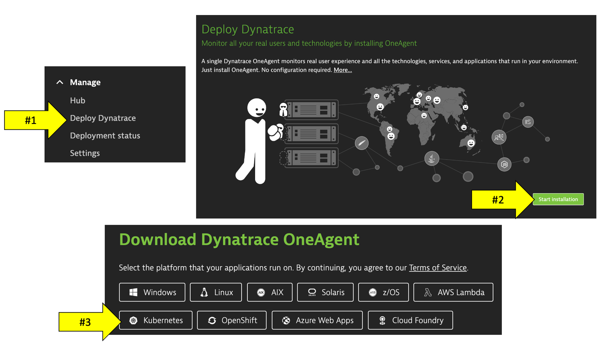

# HCL Universal Orchestrator Observability for Dynatrace

You can use HCL Universal Orchestrator (UnO) Observability for Dynatrace to monitor HCL Universal Orchestrator metrics, events, audit and infrastructure logs.

## Content
- [HCL Universal Orchestrator for Dynatrace](#hcl-universal-orchestrator-for-dynatrace)
  - [Content](#content)
  - [Prerequisites](#prerequisites)
  - [Language support](#language-support)
  - [Solution setup](#solution-setup)
      - [1. Installating and configuring dynatrace](#1-installating-and-configuring-dynatrace)
      - [2. Install Dynatrace Operator](#2-install-dynatrace-operator)
      - [3. Verify Dynatrace Operator](#3-verify-dynatrace-operator)
      - [4. Verify Dynatrace Monitoring](#4-verify-dynatrace-monitoring)
  - [Log Processing and Ingestion setup](#log-processing-and-ingestion-setup)
      - [1. Log custom attributes](#1-log-custom-attributes)
      - [2. Log processing](#2-log-processing)
      - [3. Log metrics](#3-log-metrics)
      - [4. Custom log source configuration](#4-custom-log-source-configuration)
      - [5. Log storage configuration](#5-log-storage-configuration)
  - [Metric Processing and Ingestion setup](#metric-processing-and-ingestion-setup)
      - [1. Metric Ingestion](#1-metric-ingestion)
      - [2. Setting Metadata](#2-setting-metadata)
  - [UnO Monitoring Dashboards and Alerts setup in Dynatrace](#uno-monitoring-dashboards-and-alerts-setup-in-dynatrace)
       - [1. Getting Environment Link](#1-getting-environment-link)
       - [2. Create Access Token](#2-create-access-token)
       - [3. Create Dashboards and Alerts](#3-create-dashboards-and-alerts)
       - [4. Configuring dashboard markdown link](#4-configuring-dashboard-markdown-link)
       - [5. Setup Email Notification for Alerts ( Optional )](#5-setup-email-notification-for-alerts--optional-)
          - [a). Configuring Alert Profile](#a-configuring-alert-profile)
          - [b). Configuring Email Integration](#b-configuring-email-integration)
  - [Getting Started with Universal Orchestrator Monitoring](#getting-started-with-universal-orchestrator-monitoring)
  - [FAQs](#faqs)

## Prerequisites
Following prerequisites must be satisfied prior to deploy the Dynatrace Solution: 
- Kubernetes cluster(GKE) with administrative access
- UnO v1.1 installed on the Kubernetes cluster 
- Tools & Packages 
  - Dynatrace SaaS Version 1.268

## Language support
For the dashboards provided within UnO Observability for Dynatrace, the only supported language is English. 

## Solution setup

NOTE: If you are using Dynatrace version higher than 1.268 switch to the requird version by running the following:

   In the Dynatrace menu > Select user profile > Turn off Latest Dynatrace

### 1. Installating and configuring Dynatrace
1. From [HCL License Portal](https://id.hcltechsw.com/login/login.htm) download the appropriate HCL Universal Orchestrator Observability installation package:
   Universal Orchestrator for UnO Observability Add-on
   
2.  Installation package for Datadog: UNO_OBSERVABILITY_APP_FOR_DYNATRACE_1.1.0.0.tar.gz

3. Follow the below command to untar the gzip file 
  
  ```
	tar -xvzf UNO_OBSERVABILITY_APP_FOR_DYNATRACE_1.1.0.0.tar.gz
  ```

4. Follow the steps mentioned on this ReadMe file to complete the solution setup.

#### 2. Install Dynatrace Operator  

To navigate to Kubernetes page, follow these steps and refer to the picture below:

 
1. Within Dynatrace, click on the Deploy Dynatrace menu.
2. Select Start Installation button.
3. Select Kubernetes based on UnO installed cluster.

To get the Dynatrace Operator installation command, refer to the steps and pictures below:


1. On the Kubernetes configuration page, enter dynatrace for the name. This is not the cluster name, it will show up as the Kubernetes page name in Dynatrace.
2. Select Create token.
3. Select the Enable volume storage Check to be ON.
4. Click the Copy button.

Paste the command in your environment and run it.

#### 3. Verify Dynatrace Operator  

Once the script is complete, monitor the installation until all pods are in Running state with all pods as 1/1.
```
kubectl -n dynatrace get pods
```
Rerun the command until the output looks like this:


#### 4. Verify Dynatrace Monitoring
1. Go to Infrastructure > Kubernetes.
2. Select Dynatrace cluster name.
3. Verify all namespaces are present.


NOTE : This Dynatrace version is monitoring all the namespaces in the cluster.So add your namespaces in the global filter to see your namespace related information.

## Log Processing and Ingestion setup
 Dynatrace OneAgent collects all logs container and pods then send it to Dynatrace SaaS. The logs are unstructured so, follow the steps to process the logs.  

 NOTE : This Log Processing and Ingestion setup is developed and tested on Dynatrace SaaS Version 1.268.

#### 1. Log custom attributes

1. In the Dynatrace menu, go to Settings.
2. Select Settings > Log Monitoring > Custom attributes and then select Add Custom Attribute.
3. Add key as Attributes table values.
4. Turn on show attribute value in side bar.
5. Select Save Changes.  

| Attributes |
| ------ | 
| action.type | 
| object.type |
| username | 
| objectname |
| arguments |
| definition |


#### 2. Log processing 

1. In the Dynatrace menu, go to Settings.
2. Select Settings > Log Monitoring > Processing and then select Add Processing Rule.
3. Add Processor name as mentioned below.
```
UNO Log Parsing
```
4. Add Matcher as mentioned below.

```
content="objectType"
```

 For Dynatrace Version 1.269 or above,Use the below matches
```
matchesPhrase(content, "objectType")
```

5. Add Processor definition as mentioned below:   
```
USING(INOUT content)
| PARSE(content,"STRING SPACE 'stdout F' SPACE JSON:content") 
| FIELDS_ADD(object.type: content["objectType"], 
action.type:content["actionType"] ,
definition:content["definition"] ,
arguments:content["arguments"] ,
username:content["userName"] ,
objectname:content["objectName"] )
```
6. Add log sample as mentioned below:
```
{
  "content":"2023-04-18T09:19:12.574918247Z stdout F {\"timestamp\":\"2023-04-18T09:19:12.516Z\",\"objectType\":\"PLJOB\",\"actionType\":\"CHANGE_JOB_STATUS\",\"definition\":\"AWSMOR049I \\\"TEST12\\\" status changed to \\\"READY READY_WAITING_FOR_RESOURCES\\\".\",\"arguments\":\"{\\\"newStatus\\\":\\\"READY READY_WAITING_FOR_RESOURCES\\\",\\\"entityName\\\":\\\"TEST12\\\"}\",\"userName\":\"system\",\"objectName\":\"TEST12\"}"
}
```
7. Select Save Changes.  

#### 3. Log metrics 

1. In the Dynatrace menu, go to Settings.
2. Select Settings > Log Monitoring > Metrics extraction and then select Add log metric. 
3. Add Key as mentioned below:
```
log.uno.content
```
4. Add Matcher as mentioned below.
```
content="objectType"
```
 For Dynatrace Version 1.269 or above, use the below matches:
```
matchesPhrase(content, "objectType")
```
5. Select Measure as mentioned below:
```
Occurrence of logs records
```
6. Add all the Dimension(s) mentioned below:

  | Dimension |
  | ------ | 
  | action.type | 
  | object.type |
  | username | 
  | objectname |
  | arguments |
  | definition |
  
7. Select Save Changes.  

#### 4. Custom log source configuration 

1. In the Dynatrace menu, go to Settings.
2. Select Settings > Log Monitoring > Custom log source configuration.
3. Activate Custom log source if not activated. 
4. Add Rule name as UNO Logs.
5. Select Process groups that contains below text.
```
uno-app.jar hcl-uno-audit*
```
6. Select Log source type as Log path.
7. Add Custom log path source as below.
```
/var/log/pods/*/audit-log-sidecar/#.log
```
8. Select Save Changes.  

#### 5. Log storage configuration 

1. In the Dynatrace menu, go to Setting.s
2. Select Settings > Log Monitoring > Log storage configuration.
3. Update to new Log storage configuration if not updated.
4. Select Add rule then Add Rule name as UNO Log Storage.
5. Select Rule type as Include in storage.
6. Select Add Matcher and then select Matcher attribute as Log Source.
7. Add the below log path of audit sidecar then select Add Matcher: 
```
/var/log/pods/*/audit-log-sidecar/#.log
```
7. Select Save Changes.  


## Metric Processing and Ingestion setup

### 1. Metric Ingestion 

1. In Dynatrace, go to your Kubernetes cluster settings page and enable
   - Monitor Kubernetes namespaces, services, workloads, and pods
   - Monitor annotated Prometheus exporters

```
kind: Service
apiVersion: v1
metadata:
  name: dynatrace-monitoring-node-exporter
  namespace: maestro-suite
  annotations:
    metrics.dynatrace.com/port: '8443'
    metrics.dynatrace.com/scrape: 'true'
    metrics.dynatrace.com/secure: 'true'
    metrics.dynatrace.com/path: '/q/metrics'
    metrics.dynatrace.com/insecure_skip_verify: 'true'
spec:
  ports:
    - name: dynatrace-monitoring-node-exporter-port
      port: 8443
  selector:
    release: hcl-uno-chart
  clusterIP: None
  ``` 

2. Copy the above service content and save it as dynakube-service.yaml file. 

3. Run the below command and describe any pods from maestro-suite and update the dynakube-service.yaml file:
```
kubectl describe pod <POD_NAME>  -n maestro-suite
``` 
4. Replace namespace from dynakube-service.yaml with maestro-suite namespace.

5. Replace port, path annotation from dynakube-service.yaml with your pod annotation values.

6. Replace release selector from dynakube-service.yaml with maestro-suite pod release label value.

7. Run the blow command to create the service:
 ```
 kubectl create -f dynakube-service.yaml
 ```

### 2. Setting Metadata 
There are a few metrics to which you are required to provide metadata to have good analysis on dashboards.

| Metric name	 | Display name |
| ------ | ------ |
|  application_uno_orchestrator_job_by_folder |	Jobs by folder |
| application_uno_orchestrator_job_by_workstation  |	Jobs by workstation |

Steps to follow:
1. Go to Menu, Observe and Explore > Metrics.
2. In filter bar, enter the name of any metrics mentioned above and that metric will be filtered out.
3. Select Edit metadata.
4. Give Display name which is given in above table respectively.
5. Follow this procedure for all the metrics.


<!--  -->

NOTE :  Follow this setting metadata step once the mentioned metrics are ingestion into Dynatrace.

## UnO Monitoring Dashboards and Alerts setup in Dynatrace
   Follow the below steps to upload and configure the UnO Monitoring Dashboards and Alerts.
   
NOTE : This Alerts and Email Notification setup is developed and tested on Dynatrace SaaS Version 1.268.

 ##### 1. Getting Environment Link
  1. Select the user icon at the top right corner.
  2. Select Account > Account Settings.
  3. Go to Consumption by Environment section.
  4. Select your Environment and copy the link address of Environment.

 ##### 2. Create Access Token
 1. In the Dynatrace menu, go to Access Token and then select Generate new Token.
 2. Add your Token name , Expiration date. 
 3. Select template as None.
 4. Select the scopes mentioned below table.

 | Scope |
| ------ | 
| Write configuration | 
| Ingest metrics |

 5. Select Generate Token and then Copy the Generated Token for further use.

 ##### 3. Create Dashboards and Alerts


1. Run the starter.sh with your ***ENVIRONMENT_LINK***, ***ACCESS_TOKEN*** as parameters. Follow this below command as example.

```
 $ sh ./starter.sh ENVIRONMENT_LINK ACCESS_TOKEN 
```

 
 
 2. Copy the Dashboard ID from terminal for further use.

 3. In the Dynatrace menu, go to Dashboards:  
  
    - Turn ON show all tenant dasboards option
    - Select Owner as UnO Monitoring
    - Verify all the dashboards are created

 

 4. In the Dynatrace menu, go to Settings.
       - Go to Setting > Anomaly detection > Metric events.
       - Verify all the created alerts.


 ##### 4. Configuring dashboard markdown link
 
UnO Observability Dashboard​ provides the link to all dashboards. Once the dashboard is created, new dashboard id is generated for each and every dashboards. So every dashboard id needs to be updated on the UnO Observability Dashboard​ markdown component.

1. Get the copied dashboard id from the Create dashboard step.
2. In the Dynatrace menu, go to Dashboards.  
3. Select UnO Observability Dashboard:
    - Select Edit option at the top right corner.
    - Go to the bottom of the dashboard.
    - Select the markdown component as shown in the image and replace your ENVIRONMENT_LINK and id with your respective dashboard id.
    - Do this same step for all dashboards. (KPIS and Workstation,Auditing Dashboard,Infrastructure Dashboard). 

 

4. Select Done.

 ##### 5. Setup Email Notification for Alerts ( Optional )
 

 ###### a). Configuring Alert Profile

 1. In the Dynatrace menu, go to Settings > Alerting > Alerting profiles.
 2. Type a name for the new profile in the Create new alerting profile field and select Create.
 3. Select Add severity rule then select Problem severity level as **Custom**.
 4. Add Problem send delay in minutes as per your requirement. For example, if you add 30, then an email notification will be sent only if the problem remains open for 30 minutes.
 5. Select Save Changes. Keep a note of your Alert Profile Name for future use.   

 


 ###### b). Configuring Email Integration

   See: [Email Integration](https://www.dynatrace.com/support/help/setup-and-configuration/integrations/problem-notifications/email-integration) documentation to configure email notification for alerts.

 

  NOTE : Select the Alerting Profile Name you have configured in the previous step.


## Getting Started with Universal Orchestrator Monitoring

**UnO Observability Dashboard** provides a single, consolidated view for monitoring the workload status. By selecting the dashboard on the list, you can see the information related to that dashboard.

UnO Observability Dashboard:

 

By clicking a button or menu option, you open a new tab displaying the selected dashboard information. The following dashboards are supported: 


- **KPIs and Workstations Dashboard**. This dashboard shows the Universal Orchestrator KPIs information for each host and allows drilldown to see the timeseries data in visual representation for defined KPIs.

  Source of Information : API exposed by all the pods on port 8443.
   
- **Auditing Dashboard**. This dashboard shows details of workstations and audit information such as user actions. Users can view audit information for selected time range, user and object. 

  Source of Information:  UnO sidecar audit containers, for example: audit-log-sidecar. 

- **Infrastructure Dashboard**. This dashboard provides an overview of the infrastructure details of Universal Orchestrator deployed on Kubernetes cluster.
 Filter by your Kubernetes namespace and view the dasboard as shown below: 
 
 
 
  Source of Information: Infrastructure Logs exposed by kubernetes cluster. 

 - **Custom Alerts and Problems**.
 See: [Metric events for alerting](https://www.dynatrace.com/support/help/how-to-use-dynatrace/problem-detection-and-analysis/problem-detection/metric-events-for-alerting#create-a-metric-event) documentation to create your problems. The following table shows some of the out-of-the-box alert definitions that come with the UnO Observability Dashboard:

| Alert Name	 | Threshold Condition |
| ------ | ------ |
| Uno_Agent_Linked	 | ==0 (more than 5 minutes in 5 minutes slot ) |


## FAQs


1. Q: The steps mentioned in the Log storage configuration ar not matching.

   A: Update to new Log storage configuration if not updated.

2. Q. The steps Custom log source configuration are not matching.
 
    A: Activate Custom log source if not activated.
     
3. Q: Which version of Dynatrace is supported for this setup? 
  
   A. This setup is supported for Dynatrace SaaS Version 1.268.
    
4. Q: How can I switch to Dynatrace version 1.268 from higer version? 
  
   A: In the Dynatrace menu > Select user profile > Turn off Latest Dynatrace.
     
5. Q: Metrics are not ingested into Dynatrace ? 
     
   A: In Dynatrace, go to your Kubernetes cluster settings page and enable
     - Monitor Kubernetes namespaces, services, workloads, and pods
     - Monitor annotated Prometheus exporters

6. Q: Logs are not ingested into Dynatrace after redploying UnO installation? 
   
   A: New Process group will be generated for new deployment. So redo the step [4. Custom log source configuration](#4-custom-log-source-configuration) again.

7. Q: How can I filter information on dashboards?

   A: There is a dynamic filter on each dashboard. Multiple custom dimensions are already present specific to each dashboard. 
  You can use these custom dimensions and give specific input to the filter.
   

8. Q: How many dashboards are available?
     
   A:  You can import and use the following 5 dashboards:
    - HCL Universal Orchestrator Observability Dashboard (Overview Dashboard) 
    - KPIs and Workstations Dashboard
    - Auditing Dashboard
    - Infrastructure Dashboard
    
9. Q: How can I get quick glimpses of various information ?
 
   A:  Use the HCL Universal Orchestrator Observability Dashboard for this purpose.

10. Q: HCL Universal Orchestrator Observability Dashboard doesn't show infrastructure details of your Kubernetes cluster?

      A: Filter by your Kubernetes namespace and view the infrastructure details .

11. Q: How to get Email if Problem/Alert exist for more than 30 minutes? 
    A: Run the following steps:
    - In the Dynatrace menu, go to Settings > Alerting > Alerting profiles.
    - Select your Alerting profiles integrated with problem notification.
    - Select Severity rule > Custom Alerts > Add your Problem send delay in minutes.

12. Q: Are KPIs and Workstation information displayed as metrics name?

    A: Follow the [Setting Metadata](#2-setting-metadata) to update the metrics metadata name.

13. Q: What are the other ways to get the Dashboard ID? 
  
    A: Open the Dashboard in the browser and copy the ID field from browser URL.

14. Q: Duplicate Dashboard and Alert are created on the Dynatrace?

    A. Retrying [Create Dashboards and Alerts](#3-create-dashboards-and-alerts) step mutiple times will create duplicate entry on Dynatrace. So the script is executed wait for some minutes and refresh the Dyntarce and check the Dashboards.

15. Q: How to improvise analysis using dashboard further?
    A: In the dashboard, for the pie-chart representation there is a quick way to see specific analysis:
    - Select any of the option which you want to omit e.g., Ready in Job status
    - Select ready and thus, pie-chart will not show results of Ready in pie-chart
  
16. Q: How to Clone dashboard?
    A: Run the following steps:
     - In the Dynatrace menu, go to Dashboards.
     - Filter the respective dashboard and click more symbol.
     - Select Clone option.
